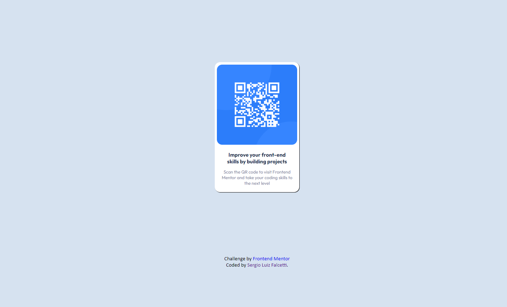

# Desafio Frontend Mentor - "QR code component solution"

Essa é uma solução para o desafio "Front End Mentor" [QR code component challenge on Frontend Mentor](https://www.frontendmentor.io/challenges/qr-code-component-iux_sIO_H). 
## Índice

- [Visão Geral](#visão-geral)
- [Screenshot](#screenshot)
- [Links](#links)
- [Feito com](#Feito-com)
- [O que aprendi](#o-que-aprendi)
- [Autor](#autor)

## Visão Geral

- Desafio proposto pelo site "Frontend Mentor" para construção de uma página estática contendo um QR-Code.

## Screenshot

## Links

- Solution URL: [https://github.com/falcettijr/QRCode](https://github.com/falcettijr/QRCode)
- Live Site URL: [Live Site](https://falcettijr.github.io/QRCode/)

## Feito com

- Semantic HTML5 markup
- CSS 3 
- Flexbox

## O que aprendi

Nesse projeto eu treinei minha habilidades em HTML semântico e CSS3.

## Author

- Website - [Sergio Falcetti](https://beacons.ai/sergiofalcetti)
- Frontend Mentor - [@falcettijr](https://www.frontendmentor.io/profile/falcettijr)
- Git-Hub - [@falcettijr](https://github.com/falcettijr)
